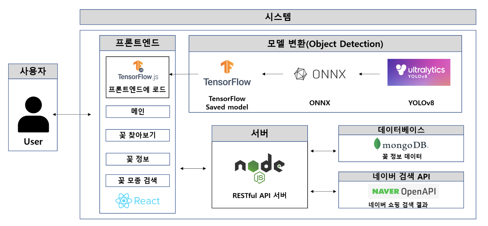

# 🌸 Flower Detection with YOLOv8

> YOLOv8 기반 실시간 꽃 탐지 웹 서비스  
> 이미지나 웹캠을 통해 꽃을 탐지하고, 식별된 꽃 정보를 DB 및 네이버 쇼핑 검색 결과와 함께 제공합니다.

---

## 📷 데모 예시


---

## 🧠 YOLOv8란?

[YOLOv8](https://github.com/ultralytics/ultralytics)은 **실시간 객체 탐지 모델** 중 최신 버전으로, 다음과 같은 특징을 가집니다:
- 고성능 경량화 모델 (ONNX, TensorFlow.js 변환 가능)
- 객체 탐지, 분할, 포즈 추정 등 지원
- Colab 또는 로컬에서 손쉽게 학습 가능

본 프로젝트에서는 YOLOv8 커스텀 모델을 학습하여 꽃 탐지에 특화된 인공지능을 구현했습니다.

---

## ⚙️ 시스템 아키텍처



**구성 요소:**

| 구성 | 설명 |
|------|------|
| 🔍 **객체 탐지** | YOLOv8으로 꽃 객체를 탐지 |
| 🌐 **프론트엔드** | React 기반 SPA, Netlify에 배포 |
| 🧠 **모델** | Roboflow 어노테이션 + Colab에서 학습, TensorFlow.js로 변환 |
| 🔙 **백엔드** | Node.js + Express 서버 (Heroku 배포), MongoDB 연결 |
| 🔍 **네이버 API** | 꽃 이름으로 관련 쇼핑 검색 결과 제공 |

---

## 🧪 주요 기능

- 이미지 업로드 또는 웹캠으로 실시간 꽃 탐지
- 탐지된 꽃 이름을 기반으로 DB에서 상세 정보 조회
- 네이버 쇼핑 API로 "꽃 모종" 검색 결과 필터링 및 제공
- React 기반 깔끔한 UI와 모달로 정보 출력

---

## 📦 기술 스택

- **Frontend**: React, TensorFlow.js, MUI
- **Backend**: Node.js, Express, MongoDB Atlas, Heroku
- **AI 모델 학습**: YOLOv8 (PyTorch), Google Colab
- **배포**: Netlify (FE), Heroku (BE)

---

## 📁 프로젝트 구조

```bash
flower-detection/
├── public/
├── src/
│   ├── components/
│   ├── style/
│   └── App.jsx
├── server.js         # Express 백엔드
├── README.md
